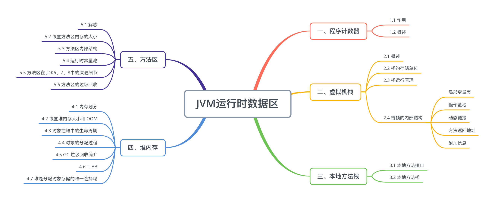

<!--
 * @Author: your name
 * @Date: 2021-09-30 20:55:48
 * @LastEditTime: 2021-09-30 21:07:20
 * @LastEditors: Please set LastEditors
 * @Description: In User Settings Edit
 * @FilePath: \interview\jvm面试题.md
-->
## 1. JVM内存结构说一下

线程共享：堆，方法区

线程私有：程序计数器，虚拟机栈，本地方法栈

**虚拟机栈**：每个线程在创建的时候都会创建一个虚拟机栈，其内部保存一个个的栈帧(Stack Frame），对应着一次次 Java 方法调用，是线程私有的，生命周期和线程一致。主管 Java 程序的运行，它保存方法的局部变量、部分结果，并参与方法的调用和返回。

**本地方法栈**：本地方法栈用于管理本地方法的调用

**程序计数器：**用来存储指向下一条指令的地址，即将要执行的指令代码。由执行引擎读取下一条指令

**栈解决程序的运行问题，即程序如何执行，或者说如何处理数据。堆解决的是数据存储的问题，即数据怎么放、放在哪。**

**堆：** Java 堆是 Java 虚拟机管理的内存中最大的一块，被所有线程共享。此内存区域的唯一目的就是存放对象实例，几乎所有的对象实例以及数据都在这里分配内存。

虚拟机把堆内存逻辑上划分成三块区域（分代的唯一理由就是优化 GC 性能）： 
- 新生带（年轻代）：新对象和没达到一定年龄的对象都在新生代
- 老年代（养老区）：被长时间使用的对象，老年代的内存空间应该要比年轻代更大 
- 元空间（JDK1.8 之前叫永久代）：像一些方法中的操作临时对象等，JDK1.8 之前是占用 JVM 内存，JDK1.8 之后直接使用物理内存

## 2. 垃圾回收算法

